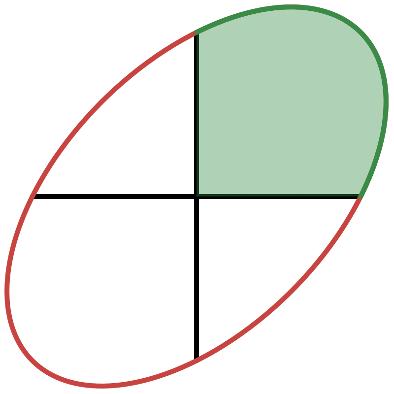

<h1 align="center">Computing the Neural Information Content</h1>

<p align="center">
  
</p>

<p align="center">
  <a href="https://jeremybernste.in" target="_blank">Jeremy&nbsp;Bernstein</a> &emsp; <b>&middot;</b> &emsp;
  <a href="http://www.yisongyue.com" target="_blank">Yisong&nbsp;Yue</a> &emsp; &emsp;
</p>

## About

This repository contains code to compute the information content of an infinitely wide neural network. What is this *information content*, exactly? Well, it's the negative log probability of the orthant in function space that is consistent with the training labels, where probability is calculated with respect to the Gaussian measure on function space that is induced by the neural architecture.

For a training set with binary class labels, there are three steps to compute it:
1. For all pairs of training inputs `x_i` and `x_j`, compute the correlations between network outputs under random sampling of the network weights: `Sigma_ij := Expect_w [ f(x_i,w) f(x_j,w) ]`.
2. For random vector `z` distributed Normally with mean `0` and covariance `Sigma`, estimate the probability `p := Prob[sign z = c]` where `c` is the binary vector of class labels.
3. Return `log 1/p`.

And why is this interesting? Well, PAC-Bayes guarantees generalisation when the information content `log 1/p` is smaller than the number of training data points. More details are given in [our paper](https://arxiv.org/abs/2103.01045).

## Getting started
- Run the unit tests:
```bash
python unit_test.py
```
- Run the main script:
```bash
python pac-bayes.py
```
- Generate the plots using the Jupyter notebook `make_plots.ipynb`.

## Environment details
The code was run on:
- Pytorch 1.5.0
- Using docker container nvcr.io/nvidia/pytorch:20.03-py3
- On an NVIDIA Titan RTX GPU, with driver version 440.82, CUDA Version: 10.2

For the exact version of the code used in arXiv:2103.01045, go back to commit 49cc144.

## Citation

If you find this code useful, feel free to cite [the paper](https://arxiv.org/abs/2103.01045):

```bibtex
@inproceedings{entropix,
  title={Computing the Information Content of Trained Neural Networks},
  author={Jeremy Bernstein and Yisong Yue},
  booktitle={Workshop on the Theory of Overparameterized Machine Learning},
  year={2021}
}
```

## License

We are making our algorithm available under a [CC BY-NC-SA 4.0](https://creativecommons.org/licenses/by-nc-sa/4.0/) license.
